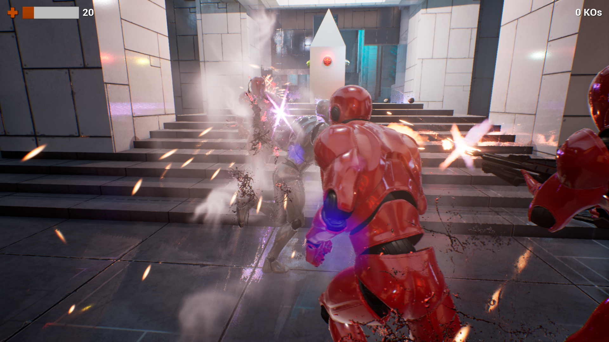

# Stealth Temple: Game with Multi-Agent, Behaviour-oriented Enemy Artificial Intelligence (Bachelor Thesis)

## Abstract

Artificial intelligence is used in video games to create believable characters that challenge the player and enrich the playing experience. The stealth genre is one of the types of games where it is fundamental to have non-player characters with the ability to perceive the environment, detect some of the player character’s actions and react to them with astute strategies.

The goal of this project was to develop a stealth game with enemy characters that would cooperate to defeat the player. In the final game, the enemies patrol the game’s world trying to locate the player character, and they investigate any potential signs of player actions in the environment, such as objects in motion or bodies of unconscious characters on the floor. The findings of an enemy are immediately communicated to the rest of agents, and the player character is chased and attacked by the enemies after being spotted. While some of the agents pursue the player character and use close combat moves, others reduce speed to shoot the character in the head with precision from distant positions.

The game was developed with the Unreal Engine 4 game engine. The reasoning and decision-making of enemies was modelled using behaviour trees. The implemented system makes agents capable of perceiving visual and auditory stimuli and communicating  information to other agents, who compare it with their own knowledge to take independent decisions. The whole set of enemies form an artificial intelligence-based multi-agent system and cooperate to achieve the shared goal of defeating the player in the shortest time possible.

The ability of the numerous enemies to spot the player character and detect sounds penalizes noisy and reckless players, who are rapidly defeated. Unlike them, those players who struggle to be silent and elusive have a reasonable chance to win the game, approaching enemies from behind, knocking them out stealthily, and hiding the bodies to avoid leaving traces that other
agents would try to use to find the player character. Stones and other objects can be thrown to make noises and distract the enemies. Nevertheless, the agents’ ability to locate the player character should not be underestimated: no hidden location is permanently safe.

## Youtube Video Playlist

You can find a [series of Youtube videos](https://www.youtube.com/watch?v=DMumS6tdhrw&list=PLWQqJ6IwMo14-ysQhEiuR3fYc--LIzeTH&index=9) that show both the end game (last two videos) and the process of developing the game modules (all the previous videos).

## Game Images

## Enemy AI Diagrams

## Used Technology

The game was developed in Unreal Engine 4, using both C++ and Blueprints.

## Development Context

This project was submitted as Thesis for the Bachelor's Degree in Computer Science at University of Barcelona, in May 2018. The report is also available in the [official repository](http://diposit.ub.edu/dspace/handle/2445/130968) of the University. The report and slides are subject to the Creative Commons Attribution Share-Alike license.
